## Finding entity classes in embeddings

In this notebook we're going to use embeddings to find entity classes and how they correlate with other things


```python
%matplotlib inline
#import matplotlib

from sklearn import svm
import tensorflow as tf
from tensorflow.keras.utils import get_file
import os
import gensim
import numpy as np
import random
import requests
import geopandas as gpd
from IPython.core.pylabtools import figsize
import csv

figsize(12, 8)

#在windows环境安装geopandas
#pip install wheel
#pip install pipwin
#pipwin install numpy
#pipwin install pandas
#pipwin install shapely
#pipwin install gdal
#pipwin install fiona
#pipwin install pyproj
#pipwin install six
#pipwin install rtree
#pipwin install geopandas
```

as before, let's load up the model


```python
MODEL = 'GoogleNews-vectors-negative300.bin'
path = './data/' + MODEL + '.gz'
unzipped = os.path.join('generated', MODEL)
if not os.path.isfile(unzipped):
    with open(unzipped, 'wb') as fout:
        zcat = subprocess.Popen(['zcat'],
                          stdin=open(path),
                          stdout=fout
                         )
        zcat.wait()
```

Most similar to a bunch of countries are some other countries!


```python
model = gensim.models.KeyedVectors.load_word2vec_format(unzipped, binary=True)
model.most_similar(positive=['Germany'])
```


    [('Austria', 0.7461061477661133),
     ('German', 0.7178748846054077),
     ('Germans', 0.6628647446632385),
     ('Switzerland', 0.6506868004798889),
     ('Hungary', 0.6504982709884644),
     ('Germnay', 0.649348258972168),
     ('Netherlands', 0.6437495946884155),
     ('Cologne', 0.6430779099464417),
     ('symbol_RSTI', 0.6389946937561035),
     ('Annita_Kirsten', 0.6342949271202087)]


```python
model.most_similar(positive=['Annita_Kirsten'])
```


    [('Braustolz_GmbH', 0.7545095086097717),
     ('DIARY_Economic_Indicators', 0.7334568500518799),
     ('##-##_#####_Burscheid', 0.7307888269424438),
     ('WKN_A#N#Y#_Symbol', 0.7260339260101318),
     ('Hoevelaken', 0.7067490220069885),
     ('BMW_###si_1min_##.###secs', 0.7050350904464722),
     ('Primera_EUROPE', 0.699741005897522),
     ('symbol_RSTI', 0.6925467252731323),
     ('Severin_Freund', 0.6898956894874573),
     ('However_Joern_Lauterjung', 0.6885738968849182)]


No we'll create a training set with countries and non countries and get a support vector machine to learn the difference.


```python
countries = list(csv.DictReader(open('data/countries.csv')))
countries[:10]
```


    [{'name': 'Canada', 'cc': 'ca', 'cc3': 'can'},
     {'name': 'Turkmenistan', 'cc': 'tm', 'cc3': 'tkm'},
     {'name': 'Ethiopia', 'cc': 'et', 'cc3': 'eth'},
     {'name': 'Swaziland', 'cc': 'sz', 'cc3': 'swz'},
     {'name': 'Czech_Republic', 'cc': 'cz', 'cc3': 'cze'},
     {'name': 'Cameroon', 'cc': 'cm', 'cc3': 'cmr'},
     {'name': 'UAE', 'cc': 'ae', 'cc3': 'are'},
     {'name': 'Liberia', 'cc': 'lr', 'cc3': 'lbr'},
     {'name': 'Netherlands', 'cc': 'nl', 'cc3': 'nld'},
     {'name': 'East_Timor', 'cc': 'tl', 'cc3': 'tls'}]


```python
positive = [x['name'] for x in random.sample(countries, 40)]
negative = random.sample(model.key_to_index.keys(), 5000)
negative[:4]
```


    ['Rangeloff', 'Punch_Masenamela', 'Volcano_spews_ash', 'flagged_MV']


```python
labelled = [(p, 1) for p in positive] + [(n, 0) for n in negative]
random.shuffle(labelled)
X = np.asarray([model[w] for w, l in labelled])
y = np.asarray([l for w, l in labelled])
X.shape, y.shape
```


    ((5040, 300), (5040,))


```python
TRAINING_FRACTION = 0.3
cut_off = int(TRAINING_FRACTION * len(labelled))
clf = svm.SVC(kernel='linear')
clf.fit(X[:cut_off], y[:cut_off]) 
```


    SVC(kernel='linear')


We did alright, 99.9% precision:


```python
res = clf.predict(X[cut_off:])

missed = [country for (pred, truth, country) in 
 zip(res, y[cut_off:], labelled[cut_off:]) if pred != truth]

100 - 100 * float(len(missed)) / len(res), missed
```


    (99.71655328798185,
     [('Greenland', 1),
      ('Samoa', 1),
      ('former_colonizer', 0),
      ('Luxembourg', 1),
      ('Gambia', 1),
      ('Bermuda', 1),
      ('United_States', 1),
      ('Brunei', 1),
      ('Kuwait', 1),
      ('Spassky', 0)])


```python
all_predictions = clf.predict(model.vectors)
```


```python
res = []
for word, pred in zip(model.index_to_key, all_predictions):
    if pred:
        res.append(word)
        if len(res) == 150:
            break
random.sample(res, 10)
```


    ['Italy',
     'Congo',
     'Germany',
     'Belgium',
     'Syria',
     'nations',
     'Tunisia',
     'Cuba',
     'Algeria',
     'Pyongyang']


```python
country_to_idx = {country['name']: idx for idx, country in enumerate(countries)}
country_vecs = np.asarray([model[c['name']] for c in countries])
country_vecs.shape
```


    (184, 300)


Quick sanity check to see what is similar to Canada:


```python
dists = np.dot(country_vecs, country_vecs[country_to_idx['Canada']])
for idx in reversed(np.argsort(dists)[-10:]):
    print(countries[idx]['name'], dists[idx])
```

    Canada 7.544024
    New_Zealand 3.9619699
    Finland 3.9392407
    Puerto_Rico 3.838145
    Jamaica 3.8102932
    Sweden 3.8042789
    Slovakia 3.703874
    Australia 3.671101
    Bahamas 3.6240416
    United_States 3.5374339


Ranking countries for a specific term:


```python
def rank_countries(term, topn=10, field='name'):
    if not term in model:
        return []
    vec = model[term]
    dists = np.dot(country_vecs, vec)
    return [(countries[idx][field], float(dists[idx])) 
            for idx in reversed(np.argsort(dists)[-topn:])]
```


```python
rank_countries('cricket')
```


    [('Sri_Lanka', 5.92276668548584),
     ('Zimbabwe', 5.336524963378906),
     ('Bangladesh', 5.192489147186279),
     ('Pakistan', 4.948408126831055),
     ('Guyana', 3.9162838459014893),
     ('Barbados', 3.757995128631592),
     ('India', 3.7504401206970215),
     ('South_Africa', 3.6561501026153564),
     ('New_Zealand', 3.642028570175171),
     ('Fiji', 3.608567714691162)]


Now let's visualize this on a world map:


```python
world = gpd.read_file(gpd.datasets.get_path('naturalearth_lowres'))
world.head()
```


<div>
<style scoped>
    .dataframe tbody tr th:only-of-type {
        vertical-align: middle;
    }

    .dataframe tbody tr th {
        vertical-align: top;
    }

    .dataframe thead th {
        text-align: right;
    }
</style>
<table border="1" class="dataframe">
  <thead>
    <tr style="text-align: right;">
      <th></th>
      <th>pop_est</th>
      <th>continent</th>
      <th>name</th>
      <th>iso_a3</th>
      <th>gdp_md_est</th>
      <th>geometry</th>
    </tr>
  </thead>
  <tbody>
    <tr>
      <th>0</th>
      <td>920938</td>
      <td>Oceania</td>
      <td>Fiji</td>
      <td>FJI</td>
      <td>8374.0</td>
      <td>MULTIPOLYGON (((180.00000 -16.06713, 180.00000...</td>
    </tr>
    <tr>
      <th>1</th>
      <td>53950935</td>
      <td>Africa</td>
      <td>Tanzania</td>
      <td>TZA</td>
      <td>150600.0</td>
      <td>POLYGON ((33.90371 -0.95000, 34.07262 -1.05982...</td>
    </tr>
    <tr>
      <th>2</th>
      <td>603253</td>
      <td>Africa</td>
      <td>W. Sahara</td>
      <td>ESH</td>
      <td>906.5</td>
      <td>POLYGON ((-8.66559 27.65643, -8.66512 27.58948...</td>
    </tr>
    <tr>
      <th>3</th>
      <td>35623680</td>
      <td>North America</td>
      <td>Canada</td>
      <td>CAN</td>
      <td>1674000.0</td>
      <td>MULTIPOLYGON (((-122.84000 49.00000, -122.9742...</td>
    </tr>
    <tr>
      <th>4</th>
      <td>326625791</td>
      <td>North America</td>
      <td>United States of America</td>
      <td>USA</td>
      <td>18560000.0</td>
      <td>MULTIPOLYGON (((-122.84000 49.00000, -120.0000...</td>
    </tr>
  </tbody>
</table>
</div>


We can now plot some maps!


```python
def map_term(term):
    d = {k.upper(): v for k, v in rank_countries(term, topn=0, field='cc3')}
    world[term] = world['iso_a3'].map(d)
    world[term] /= world[term].max()
    world.dropna().plot(term, cmap='OrRd')

map_term('coffee')
```


    
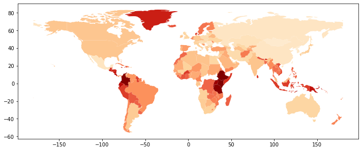
    


```python
map_term('cricket')
```


    

    


```python
map_term('China')
```


    

    


```python
map_term('vodka')
```


    
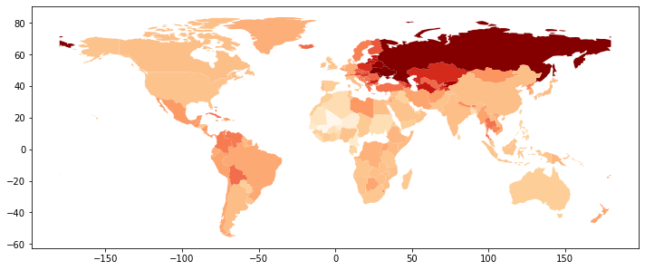
    


```python
map_term('tea')
```


    
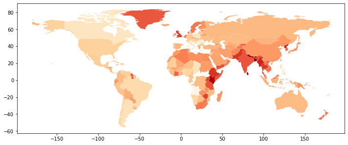
    


```python
map_term('KFC')
```


    
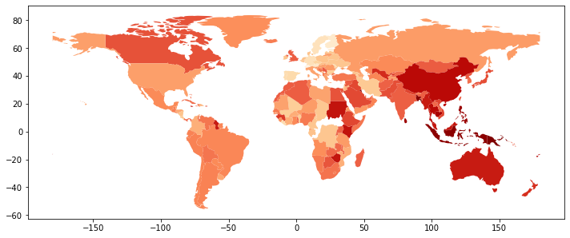
    


```python
map_term('McDonald')
```


    
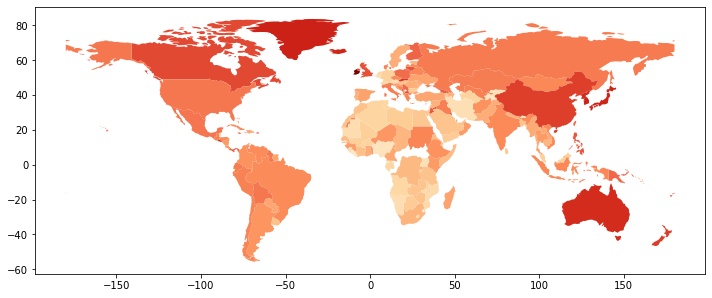
    


```python
map_term('BarackObama')
```


    

    


```python
map_term('Xi')
```


    
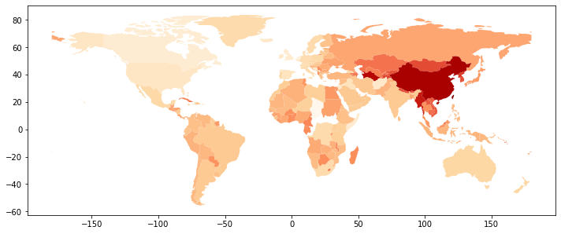
    


```python
map_term('America')
```


    
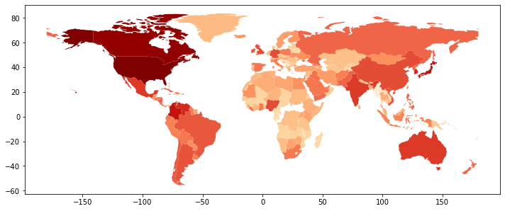
    


```python
map_term('taiwan')
```


    
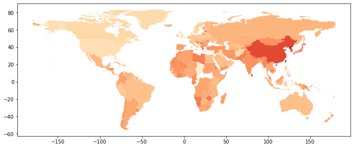
    


```python
map_term('HongKong')
```


    

    


```python
map_term('Xinjiang')
```


    

    


```python
map_term('Ebola')
```


    

    


```python
map_term('google')
```


    
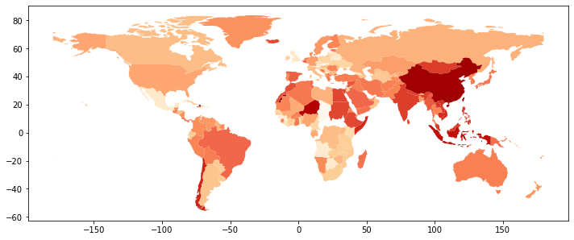
    


```python
map_term('BTC')
```


    
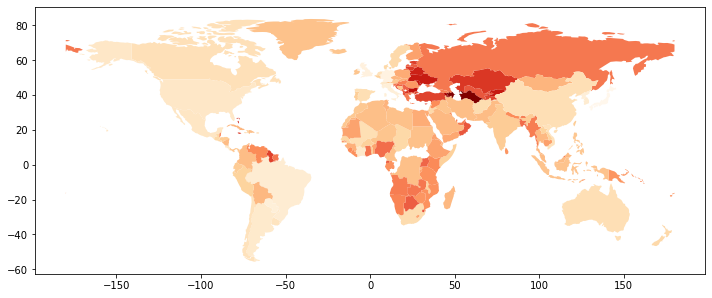
    


```python
map_term('Syrian')
```


    
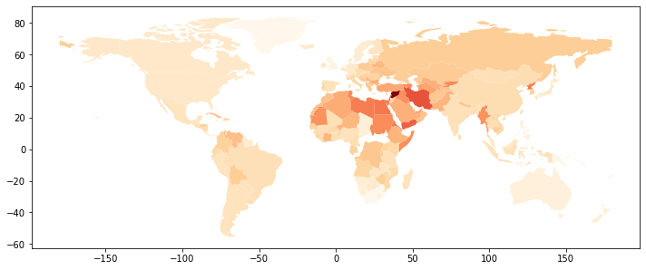
    


```python
world
```


<div>
<style scoped>
    .dataframe tbody tr th:only-of-type {
        vertical-align: middle;
    }

    .dataframe tbody tr th {
        vertical-align: top;
    }

    .dataframe thead th {
        text-align: right;
    }
</style>
<table border="1" class="dataframe">
  <thead>
    <tr style="text-align: right;">
      <th></th>
      <th>pop_est</th>
      <th>continent</th>
      <th>name</th>
      <th>iso_a3</th>
      <th>gdp_md_est</th>
      <th>geometry</th>
      <th>coffee</th>
      <th>cricket</th>
      <th>China</th>
      <th>vodka</th>
      <th>tea</th>
      <th>KFC</th>
      <th>McDonald</th>
      <th>Trump</th>
      <th>Xi</th>
    </tr>
  </thead>
  <tbody>
    <tr>
      <th>0</th>
      <td>920938</td>
      <td>Oceania</td>
      <td>Fiji</td>
      <td>FJI</td>
      <td>8374.0</td>
      <td>MULTIPOLYGON (((180.00000 -16.06713, 180.00000...</td>
      <td>0.415027</td>
      <td>0.609271</td>
      <td>0.423152</td>
      <td>0.251874</td>
      <td>0.200086</td>
      <td>0.833421</td>
      <td>0.450037</td>
      <td>0.517230</td>
      <td>0.396862</td>
    </tr>
    <tr>
      <th>1</th>
      <td>53950935</td>
      <td>Africa</td>
      <td>Tanzania</td>
      <td>TZA</td>
      <td>150600.0</td>
      <td>POLYGON ((33.90371 -0.95000, 34.07262 -1.05982...</td>
      <td>0.969494</td>
      <td>0.268171</td>
      <td>0.353667</td>
      <td>0.076928</td>
      <td>0.535068</td>
      <td>0.302214</td>
      <td>-0.002821</td>
      <td>0.083079</td>
      <td>0.206794</td>
    </tr>
    <tr>
      <th>2</th>
      <td>603253</td>
      <td>Africa</td>
      <td>W. Sahara</td>
      <td>ESH</td>
      <td>906.5</td>
      <td>POLYGON ((-8.66559 27.65643, -8.66512 27.58948...</td>
      <td>0.495734</td>
      <td>0.077895</td>
      <td>0.324381</td>
      <td>-0.177829</td>
      <td>0.160867</td>
      <td>0.461913</td>
      <td>0.291077</td>
      <td>0.467408</td>
      <td>0.237656</td>
    </tr>
    <tr>
      <th>3</th>
      <td>35623680</td>
      <td>North America</td>
      <td>Canada</td>
      <td>CAN</td>
      <td>1674000.0</td>
      <td>MULTIPOLYGON (((-122.84000 49.00000, -122.9742...</td>
      <td>0.210723</td>
      <td>0.088765</td>
      <td>0.378704</td>
      <td>0.127661</td>
      <td>-0.182036</td>
      <td>0.575897</td>
      <td>0.532209</td>
      <td>0.134384</td>
      <td>0.006847</td>
    </tr>
    <tr>
      <th>4</th>
      <td>326625791</td>
      <td>North America</td>
      <td>United States of America</td>
      <td>USA</td>
      <td>18560000.0</td>
      <td>MULTIPOLYGON (((-122.84000 49.00000, -120.0000...</td>
      <td>0.216337</td>
      <td>0.031172</td>
      <td>0.397792</td>
      <td>0.091227</td>
      <td>-0.026502</td>
      <td>0.293797</td>
      <td>0.347255</td>
      <td>0.232248</td>
      <td>0.060243</td>
    </tr>
    <tr>
      <th>...</th>
      <td>...</td>
      <td>...</td>
      <td>...</td>
      <td>...</td>
      <td>...</td>
      <td>...</td>
      <td>...</td>
      <td>...</td>
      <td>...</td>
      <td>...</td>
      <td>...</td>
      <td>...</td>
      <td>...</td>
      <td>...</td>
      <td>...</td>
    </tr>
    <tr>
      <th>172</th>
      <td>7111024</td>
      <td>Europe</td>
      <td>Serbia</td>
      <td>SRB</td>
      <td>101800.0</td>
      <td>POLYGON ((18.82982 45.90887, 18.82984 45.90888...</td>
      <td>-0.155929</td>
      <td>0.092870</td>
      <td>0.470871</td>
      <td>0.446460</td>
      <td>-0.286762</td>
      <td>0.549864</td>
      <td>0.426758</td>
      <td>0.350932</td>
      <td>0.441234</td>
    </tr>
    <tr>
      <th>173</th>
      <td>642550</td>
      <td>Europe</td>
      <td>Montenegro</td>
      <td>MNE</td>
      <td>10610.0</td>
      <td>POLYGON ((20.07070 42.58863, 19.80161 42.50009...</td>
      <td>-0.046268</td>
      <td>0.022910</td>
      <td>0.232920</td>
      <td>0.414075</td>
      <td>-0.386620</td>
      <td>0.121402</td>
      <td>0.430564</td>
      <td>0.493596</td>
      <td>0.165343</td>
    </tr>
    <tr>
      <th>174</th>
      <td>1895250</td>
      <td>Europe</td>
      <td>Kosovo</td>
      <td>-99</td>
      <td>18490.0</td>
      <td>POLYGON ((20.59025 41.85541, 20.52295 42.21787...</td>
      <td>NaN</td>
      <td>NaN</td>
      <td>NaN</td>
      <td>NaN</td>
      <td>NaN</td>
      <td>NaN</td>
      <td>NaN</td>
      <td>NaN</td>
      <td>NaN</td>
    </tr>
    <tr>
      <th>175</th>
      <td>1218208</td>
      <td>North America</td>
      <td>Trinidad and Tobago</td>
      <td>TTO</td>
      <td>43570.0</td>
      <td>POLYGON ((-61.68000 10.76000, -61.10500 10.890...</td>
      <td>NaN</td>
      <td>NaN</td>
      <td>NaN</td>
      <td>NaN</td>
      <td>NaN</td>
      <td>NaN</td>
      <td>NaN</td>
      <td>NaN</td>
      <td>NaN</td>
    </tr>
    <tr>
      <th>176</th>
      <td>13026129</td>
      <td>Africa</td>
      <td>S. Sudan</td>
      <td>SSD</td>
      <td>20880.0</td>
      <td>POLYGON ((30.83385 3.50917, 29.95350 4.17370, ...</td>
      <td>NaN</td>
      <td>NaN</td>
      <td>NaN</td>
      <td>NaN</td>
      <td>NaN</td>
      <td>NaN</td>
      <td>NaN</td>
      <td>NaN</td>
      <td>NaN</td>
    </tr>
  </tbody>
</table>
<p>177 rows × 15 columns</p>
</div>


```python
len(world)
```


    177


