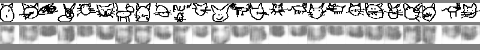
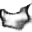
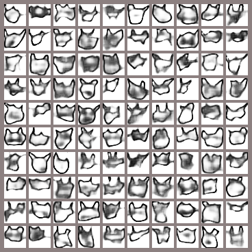
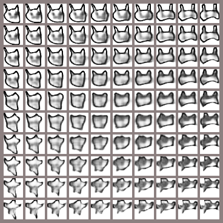

```python
from tensorflow.keras.layers import Input, Dense, Conv2D, MaxPooling2D, UpSampling2D, Reshape, Concatenate, Flatten, Lambda
from tensorflow.keras.models import Model
from tensorflow.keras.preprocessing.image import load_img, img_to_array, ImageDataGenerator
from tensorflow.keras.losses import binary_crossentropy, kullback_leibler_divergence
from tensorflow.keras import backend as K
from struct import unpack
import matplotlib.pyplot as plt
import json
import glob
from tensorflow.keras.datasets import mnist
from sklearn.model_selection import train_test_split
import numpy as np
from tensorflow.keras.optimizers import Adam
from io import BytesIO
import PIL
from PIL import ImageDraw
from tensorflow.keras.utils import get_file
from IPython.display import clear_output, Image, display, HTML
```


```python
#BASE_PATH = 'https://storage.googleapis.com/quickdraw_dataset/full/binary/'
#path = get_file('cat', BASE_PATH + 'cat.bin')
path = './data/cat.bin'
```


```python
def load_icons(path, train_size=0.85):
    x = []
    with open(path, 'rb') as f:
        while True:
            img = PIL.Image.new('L', (32, 32), 'white')
            draw = ImageDraw.Draw(img)
            header = f.read(15)
            if len(header) != 15:
                break
            strokes, = unpack('H', f.read(2))
            for i in range(strokes):
                n_points, = unpack('H', f.read(2))
                fmt = str(n_points) + 'B'
                read_scaled = lambda: (p // 8 for 
                                       p in unpack(fmt, f.read(n_points)))
                points = [*zip(read_scaled(), read_scaled())]
                draw.line(points, fill=0, width=2)
            img = img_to_array(img)
            x.append(img)
    x = np.asarray(x) / 255
    return train_test_split(x, train_size=train_size)


x_train, x_test = load_icons(path)
x_train.shape, x_test.shape
```


    ((104721, 32, 32, 1), (18481, 32, 32, 1))


```python
def create_autoencoder():
    input_img = Input(shape=(32, 32, 1))

    channels = 2
    x = input_img
    for i in range(4):
        channels *= 2
        left = Conv2D(channels, (3, 3), activation='relu', padding='same')(x)
        right = Conv2D(channels, (2, 2), activation='relu', padding='same')(x)
        conc = Concatenate()([left, right])
        x = MaxPooling2D((2, 2), padding='same')(conc)

    x = Dense(channels)(x)

    for i in range(4):
        x = Conv2D(channels, (3, 3), activation='relu', padding='same')(x)
        x = UpSampling2D((2, 2))(x)
        channels //= 2
    decoded = Conv2D(1, (3, 3), activation='sigmoid', padding='same')(x)

    autoencoder = Model(input_img, decoded)
    autoencoder.compile(optimizer='adadelta', loss='binary_crossentropy')
    return autoencoder

autoencoder = create_autoencoder()
autoencoder.summary()
```

    WARNING:tensorflow:From /root/miniconda3/lib/python3.7/site-packages/tensorflow/python/ops/init_ops.py:1251: calling VarianceScaling.__init__ (from tensorflow.python.ops.init_ops) with dtype is deprecated and will be removed in a future version.
    Instructions for updating:
    Call initializer instance with the dtype argument instead of passing it to the constructor
    WARNING:tensorflow:From /root/miniconda3/lib/python3.7/site-packages/tensorflow/python/ops/nn_impl.py:180: add_dispatch_support.<locals>.wrapper (from tensorflow.python.ops.array_ops) is deprecated and will be removed in a future version.
    Instructions for updating:
    Use tf.where in 2.0, which has the same broadcast rule as np.where
    Model: "model"
    __________________________________________________________________________________________________
    Layer (type)                    Output Shape         Param #     Connected to                     
    ==================================================================================================
    input_1 (InputLayer)            [(None, 32, 32, 1)]  0                                            
    __________________________________________________________________________________________________
    conv2d (Conv2D)                 (None, 32, 32, 4)    40          input_1[0][0]                    
    __________________________________________________________________________________________________
    conv2d_1 (Conv2D)               (None, 32, 32, 4)    20          input_1[0][0]                    
    __________________________________________________________________________________________________
    concatenate (Concatenate)       (None, 32, 32, 8)    0           conv2d[0][0]                     
                                                                     conv2d_1[0][0]                   
    __________________________________________________________________________________________________
    max_pooling2d (MaxPooling2D)    (None, 16, 16, 8)    0           concatenate[0][0]                
    __________________________________________________________________________________________________
    conv2d_2 (Conv2D)               (None, 16, 16, 8)    584         max_pooling2d[0][0]              
    __________________________________________________________________________________________________
    conv2d_3 (Conv2D)               (None, 16, 16, 8)    264         max_pooling2d[0][0]              
    __________________________________________________________________________________________________
    concatenate_1 (Concatenate)     (None, 16, 16, 16)   0           conv2d_2[0][0]                   
                                                                     conv2d_3[0][0]                   
    __________________________________________________________________________________________________
    max_pooling2d_1 (MaxPooling2D)  (None, 8, 8, 16)     0           concatenate_1[0][0]              
    __________________________________________________________________________________________________
    conv2d_4 (Conv2D)               (None, 8, 8, 16)     2320        max_pooling2d_1[0][0]            
    __________________________________________________________________________________________________
    conv2d_5 (Conv2D)               (None, 8, 8, 16)     1040        max_pooling2d_1[0][0]            
    __________________________________________________________________________________________________
    concatenate_2 (Concatenate)     (None, 8, 8, 32)     0           conv2d_4[0][0]                   
                                                                     conv2d_5[0][0]                   
    __________________________________________________________________________________________________
    max_pooling2d_2 (MaxPooling2D)  (None, 4, 4, 32)     0           concatenate_2[0][0]              
    __________________________________________________________________________________________________
    conv2d_6 (Conv2D)               (None, 4, 4, 32)     9248        max_pooling2d_2[0][0]            
    __________________________________________________________________________________________________
    conv2d_7 (Conv2D)               (None, 4, 4, 32)     4128        max_pooling2d_2[0][0]            
    __________________________________________________________________________________________________
    concatenate_3 (Concatenate)     (None, 4, 4, 64)     0           conv2d_6[0][0]                   
                                                                     conv2d_7[0][0]                   
    __________________________________________________________________________________________________
    max_pooling2d_3 (MaxPooling2D)  (None, 2, 2, 64)     0           concatenate_3[0][0]              
    __________________________________________________________________________________________________
    dense (Dense)                   (None, 2, 2, 32)     2080        max_pooling2d_3[0][0]            
    __________________________________________________________________________________________________
    conv2d_8 (Conv2D)               (None, 2, 2, 32)     9248        dense[0][0]                      
    __________________________________________________________________________________________________
    up_sampling2d (UpSampling2D)    (None, 4, 4, 32)     0           conv2d_8[0][0]                   
    __________________________________________________________________________________________________
    conv2d_9 (Conv2D)               (None, 4, 4, 16)     4624        up_sampling2d[0][0]              
    __________________________________________________________________________________________________
    up_sampling2d_1 (UpSampling2D)  (None, 8, 8, 16)     0           conv2d_9[0][0]                   
    __________________________________________________________________________________________________
    conv2d_10 (Conv2D)              (None, 8, 8, 8)      1160        up_sampling2d_1[0][0]            
    __________________________________________________________________________________________________
    up_sampling2d_2 (UpSampling2D)  (None, 16, 16, 8)    0           conv2d_10[0][0]                  
    __________________________________________________________________________________________________
    conv2d_11 (Conv2D)              (None, 16, 16, 4)    292         up_sampling2d_2[0][0]            
    __________________________________________________________________________________________________
    up_sampling2d_3 (UpSampling2D)  (None, 32, 32, 4)    0           conv2d_11[0][0]                  
    __________________________________________________________________________________________________
    conv2d_12 (Conv2D)              (None, 32, 32, 1)    37          up_sampling2d_3[0][0]            
    ==================================================================================================
    Total params: 35,085
    Trainable params: 35,085
    Non-trainable params: 0
    __________________________________________________________________________________________________


```python
from tensorflow.keras.callbacks import TensorBoard

autoencoder.fit(x_train, x_train,
                epochs=100,
                batch_size=128,
                shuffle=True,
                validation_data=(x_test, x_test),
                callbacks=[TensorBoard(log_dir='/tmp/autoencoder')])
```

    Train on 104721 samples, validate on 18481 samples
    Epoch 1/100
    104721/104721 [==============================] - 12s 113us/sample - loss: 0.6452 - val_loss: 0.6058
    Epoch 2/100
    104721/104721 [==============================] - 8s 79us/sample - loss: 0.5880 - val_loss: 0.5792
    Epoch 3/100
    104721/104721 [==============================] - 9s 83us/sample - loss: 0.5722 - val_loss: 0.5678
    Epoch 4/100
    104721/104721 [==============================] - 8s 80us/sample - loss: 0.5631 - val_loss: 0.5609
    Epoch 5/100
    104721/104721 [==============================] - 8s 78us/sample - loss: 0.5577 - val_loss: 0.5567
    Epoch 6/100
    104721/104721 [==============================] - 8s 79us/sample - loss: 0.5540 - val_loss: 0.5534
    Epoch 7/100
    104721/104721 [==============================] - 8s 79us/sample - loss: 0.5510 - val_loss: 0.5508
    Epoch 8/100
    104721/104721 [==============================] - 8s 81us/sample - loss: 0.5486 - val_loss: 0.5485
    Epoch 9/100
    104721/104721 [==============================] - 9s 84us/sample - loss: 0.5465 - val_loss: 0.5465
    Epoch 10/100
    104721/104721 [==============================] - 9s 81us/sample - loss: 0.5446 - val_loss: 0.5447
    Epoch 11/100
    104721/104721 [==============================] - 8s 80us/sample - loss: 0.5428 - val_loss: 0.5429
    Epoch 12/100
    104721/104721 [==============================] - 9s 82us/sample - loss: 0.5411 - val_loss: 0.5412
    Epoch 13/100
    104721/104721 [==============================] - 8s 79us/sample - loss: 0.5394 - val_loss: 0.5395
    Epoch 14/100
    104721/104721 [==============================] - 8s 76us/sample - loss: 0.5377 - val_loss: 0.5377
    Epoch 15/100
    104721/104721 [==============================] - 9s 82us/sample - loss: 0.5358 - val_loss: 0.5357
    Epoch 16/100
    104721/104721 [==============================] - 8s 80us/sample - loss: 0.5336 - val_loss: 0.5335
    Epoch 17/100
    104721/104721 [==============================] - 8s 81us/sample - loss: 0.5313 - val_loss: 0.5310
    Epoch 18/100
    104721/104721 [==============================] - 8s 79us/sample - loss: 0.5288 - val_loss: 0.5283
    Epoch 19/100
    104721/104721 [==============================] - 8s 79us/sample - loss: 0.5260 - val_loss: 0.5254
    Epoch 20/100
    104721/104721 [==============================] - 8s 81us/sample - loss: 0.5229 - val_loss: 0.5223
    Epoch 21/100
    104721/104721 [==============================] - 8s 78us/sample - loss: 0.5198 - val_loss: 0.5191
    Epoch 22/100
    104721/104721 [==============================] - 8s 79us/sample - loss: 0.5167 - val_loss: 0.5160
    Epoch 23/100
    104721/104721 [==============================] - 8s 77us/sample - loss: 0.5136 - val_loss: 0.5131
    Epoch 24/100
    104721/104721 [==============================] - 8s 78us/sample - loss: 0.5108 - val_loss: 0.5104
    Epoch 25/100
    104721/104721 [==============================] - 8s 78us/sample - loss: 0.5083 - val_loss: 0.5081
    Epoch 26/100
    104721/104721 [==============================] - 8s 77us/sample - loss: 0.5061 - val_loss: 0.5059
    Epoch 27/100
    104721/104721 [==============================] - 8s 75us/sample - loss: 0.5041 - val_loss: 0.5040
    Epoch 28/100
    104721/104721 [==============================] - 8s 76us/sample - loss: 0.5022 - val_loss: 0.5022
    Epoch 29/100
    104721/104721 [==============================] - 8s 74us/sample - loss: 0.5005 - val_loss: 0.5005
    Epoch 30/100
    104721/104721 [==============================] - 8s 78us/sample - loss: 0.4989 - val_loss: 0.4990
    Epoch 31/100
    104721/104721 [==============================] - 8s 79us/sample - loss: 0.4975 - val_loss: 0.4977
    Epoch 32/100
    104721/104721 [==============================] - 8s 80us/sample - loss: 0.4962 - val_loss: 0.4965
    Epoch 33/100
    104721/104721 [==============================] - 8s 79us/sample - loss: 0.4950 - val_loss: 0.4954
    Epoch 34/100
    104721/104721 [==============================] - 8s 75us/sample - loss: 0.4940 - val_loss: 0.4944
    Epoch 35/100
    104721/104721 [==============================] - 8s 78us/sample - loss: 0.4930 - val_loss: 0.4934
    Epoch 36/100
    104721/104721 [==============================] - 8s 76us/sample - loss: 0.4921 - val_loss: 0.4925
    Epoch 37/100
    104721/104721 [==============================] - 8s 72us/sample - loss: 0.4913 - val_loss: 0.4917
    Epoch 38/100
    104721/104721 [==============================] - 8s 75us/sample - loss: 0.4904 - val_loss: 0.4909
    Epoch 39/100
    104721/104721 [==============================] - 8s 76us/sample - loss: 0.4897 - val_loss: 0.4902
    Epoch 40/100
    104721/104721 [==============================] - 8s 75us/sample - loss: 0.4889 - val_loss: 0.4894
    Epoch 41/100
    104721/104721 [==============================] - 8s 78us/sample - loss: 0.4882 - val_loss: 0.4887
    Epoch 42/100
    104721/104721 [==============================] - 8s 79us/sample - loss: 0.4875 - val_loss: 0.4880
    Epoch 43/100
    104721/104721 [==============================] - 8s 75us/sample - loss: 0.4868 - val_loss: 0.4874
    Epoch 44/100
    104721/104721 [==============================] - 8s 78us/sample - loss: 0.4861 - val_loss: 0.4867
    Epoch 45/100
    104721/104721 [==============================] - 8s 76us/sample - loss: 0.4855 - val_loss: 0.4861
    Epoch 46/100
    104721/104721 [==============================] - 8s 80us/sample - loss: 0.4849 - val_loss: 0.4855
    Epoch 47/100
    104721/104721 [==============================] - 8s 75us/sample - loss: 0.4842 - val_loss: 0.4848
    Epoch 48/100
    104721/104721 [==============================] - 8s 77us/sample - loss: 0.4836 - val_loss: 0.4842
    Epoch 49/100
    104721/104721 [==============================] - 8s 76us/sample - loss: 0.4830 - val_loss: 0.4836
    Epoch 50/100
    104721/104721 [==============================] - 8s 77us/sample - loss: 0.4824 - val_loss: 0.4830
    Epoch 51/100
    104721/104721 [==============================] - 8s 76us/sample - loss: 0.4818 - val_loss: 0.4824
    Epoch 52/100
    104721/104721 [==============================] - 8s 80us/sample - loss: 0.4812 - val_loss: 0.4818
    Epoch 53/100
    104721/104721 [==============================] - 8s 78us/sample - loss: 0.4806 - val_loss: 0.4813
    Epoch 54/100
    104721/104721 [==============================] - 8s 75us/sample - loss: 0.4801 - val_loss: 0.4807
    Epoch 55/100
    104721/104721 [==============================] - 8s 76us/sample - loss: 0.4795 - val_loss: 0.4801
    Epoch 56/100
    104721/104721 [==============================] - 8s 78us/sample - loss: 0.4790 - val_loss: 0.4796
    Epoch 57/100
    104721/104721 [==============================] - 8s 73us/sample - loss: 0.4784 - val_loss: 0.4791
    Epoch 58/100
    104721/104721 [==============================] - 8s 78us/sample - loss: 0.4779 - val_loss: 0.4785
    Epoch 59/100
    104721/104721 [==============================] - 8s 76us/sample - loss: 0.4774 - val_loss: 0.4780
    Epoch 60/100
    104721/104721 [==============================] - 8s 77us/sample - loss: 0.4768 - val_loss: 0.4775
    Epoch 61/100
    104721/104721 [==============================] - 8s 80us/sample - loss: 0.4763 - val_loss: 0.4770
    Epoch 62/100
    104721/104721 [==============================] - 8s 76us/sample - loss: 0.4758 - val_loss: 0.4764
    Epoch 63/100
    104721/104721 [==============================] - 8s 74us/sample - loss: 0.4753 - val_loss: 0.4759
    Epoch 64/100
    104721/104721 [==============================] - 8s 78us/sample - loss: 0.4748 - val_loss: 0.4754
    Epoch 65/100
    104721/104721 [==============================] - 8s 73us/sample - loss: 0.4742 - val_loss: 0.4749
    Epoch 66/100
    104721/104721 [==============================] - 8s 76us/sample - loss: 0.4737 - val_loss: 0.4744
    Epoch 67/100
    104721/104721 [==============================] - 8s 78us/sample - loss: 0.4732 - val_loss: 0.4739
    Epoch 68/100
    104721/104721 [==============================] - 8s 77us/sample - loss: 0.4727 - val_loss: 0.4734
    Epoch 69/100
    104721/104721 [==============================] - 8s 76us/sample - loss: 0.4722 - val_loss: 0.4729
    Epoch 70/100
    104721/104721 [==============================] - 8s 77us/sample - loss: 0.4717 - val_loss: 0.4724
    Epoch 71/100
    104721/104721 [==============================] - 8s 77us/sample - loss: 0.4712 - val_loss: 0.4719
    Epoch 72/100
    104721/104721 [==============================] - 8s 75us/sample - loss: 0.4707 - val_loss: 0.4714
    Epoch 73/100
    104721/104721 [==============================] - 8s 76us/sample - loss: 0.4702 - val_loss: 0.4709
    Epoch 74/100
    104721/104721 [==============================] - 8s 77us/sample - loss: 0.4697 - val_loss: 0.4704
    Epoch 75/100
    104721/104721 [==============================] - 8s 76us/sample - loss: 0.4692 - val_loss: 0.4699
    Epoch 76/100
    104721/104721 [==============================] - 8s 78us/sample - loss: 0.4687 - val_loss: 0.4694
    Epoch 77/100
    104721/104721 [==============================] - 8s 78us/sample - loss: 0.4683 - val_loss: 0.4689
    Epoch 78/100
    104721/104721 [==============================] - 8s 75us/sample - loss: 0.4678 - val_loss: 0.4685
    Epoch 79/100
    104721/104721 [==============================] - 8s 77us/sample - loss: 0.4673 - val_loss: 0.4680
    Epoch 80/100
    104721/104721 [==============================] - 8s 76us/sample - loss: 0.4668 - val_loss: 0.4675
    Epoch 81/100
    104721/104721 [==============================] - 8s 78us/sample - loss: 0.4663 - val_loss: 0.4670
    Epoch 82/100
    104721/104721 [==============================] - 8s 76us/sample - loss: 0.4658 - val_loss: 0.4665
    Epoch 83/100
    104721/104721 [==============================] - 8s 72us/sample - loss: 0.4653 - val_loss: 0.4660
    Epoch 84/100
    104721/104721 [==============================] - 8s 77us/sample - loss: 0.4648 - val_loss: 0.4655
    Epoch 85/100
    104721/104721 [==============================] - 8s 77us/sample - loss: 0.4644 - val_loss: 0.4651
    Epoch 86/100
    104721/104721 [==============================] - 8s 77us/sample - loss: 0.4639 - val_loss: 0.4646
    Epoch 87/100
    104721/104721 [==============================] - 8s 76us/sample - loss: 0.4635 - val_loss: 0.4642
    Epoch 88/100
    104721/104721 [==============================] - 8s 76us/sample - loss: 0.4630 - val_loss: 0.4638
    Epoch 89/100
    104721/104721 [==============================] - 8s 72us/sample - loss: 0.4626 - val_loss: 0.4633
    Epoch 90/100
    104721/104721 [==============================] - 8s 77us/sample - loss: 0.4622 - val_loss: 0.4629
    Epoch 91/100
    104721/104721 [==============================] - 8s 75us/sample - loss: 0.4617 - val_loss: 0.4625
    Epoch 92/100
    104721/104721 [==============================] - 8s 77us/sample - loss: 0.4613 - val_loss: 0.4621
    Epoch 93/100
    104721/104721 [==============================] - 8s 77us/sample - loss: 0.4609 - val_loss: 0.4617
    Epoch 94/100
    104721/104721 [==============================] - 8s 77us/sample - loss: 0.4605 - val_loss: 0.4612
    Epoch 95/100
    104721/104721 [==============================] - 8s 78us/sample - loss: 0.4601 - val_loss: 0.4608
    Epoch 96/100
    104721/104721 [==============================] - 8s 74us/sample - loss: 0.4597 - val_loss: 0.4604
    Epoch 97/100
    104721/104721 [==============================] - 8s 76us/sample - loss: 0.4593 - val_loss: 0.4601
    Epoch 98/100
    104721/104721 [==============================] - 8s 78us/sample - loss: 0.4589 - val_loss: 0.4597
    Epoch 99/100
    104721/104721 [==============================] - 8s 74us/sample - loss: 0.4585 - val_loss: 0.4593
    Epoch 100/100
    104721/104721 [==============================] - 8s 79us/sample - loss: 0.4581 - val_loss: 0.4589


    <tensorflow.python.keras.callbacks.History at 0x7f2ae2cfeed0>


```python
cols = 25
idx = np.random.randint(x_test.shape[0], size=cols)
sample = x_test[idx]
decoded_imgs = autoencoder.predict(sample)
decoded_imgs.shape
```


    (25, 32, 32, 1)


```python
def decode_img(tile, factor=1.0):
    tile = tile.reshape(tile.shape[:-1])
    tile = np.clip(tile * 255, 0, 255)
    return PIL.Image.fromarray(tile)
    

overview = PIL.Image.new('RGB', (cols * 32, 64 + 20), (128, 128, 128))
for idx in range(cols):
    overview.paste(decode_img(sample[idx]), (idx * 32, 5))
    overview.paste(decode_img(decoded_imgs[idx]), (idx * 32, 42))
f = BytesIO()
overview.save(f, 'png')
display(Image(data=f.getvalue()))


```


    

    


```python
batch_size = 250
latent_space_depth = 64

def sample_z(args):
    z_mean, z_log_var = args
    eps = K.random_normal(shape=(batch_size, latent_space_depth), mean=0., stddev=1.)
    return z_mean + K.exp(z_log_var / 2) * eps

```


```python
def VariationalAutoEncoder(num_pixels):
    
    input_img = Input(shape=(32, 32, 1))

    channels = 4
    x = input_img
    for i in range(5):
        left = Conv2D(channels, (3, 3), activation='relu', padding='same')(x)
        right = Conv2D(channels, (2, 2), activation='relu', padding='same')(x)
        conc = Concatenate()([left, right])
        x = MaxPooling2D((2, 2), padding='same')(conc)
        channels *= 2

    x = Dense(channels)(x)
    encoder_hidden = Flatten()(x)

    z_mean = Dense(latent_space_depth, activation='linear')(encoder_hidden)
    z_log_var = Dense(latent_space_depth, activation='linear')(encoder_hidden)
    
    def KL_loss(y_true, y_pred):
        return 0.0001 * K.sum(K.exp(z_log_var) + K.square(z_mean) - 1 - z_log_var, axis=1)

    def reconstruction_loss(y_true, y_pred):
        y_true = K.batch_flatten(y_true)
        y_pred = K.batch_flatten(y_pred)
        return binary_crossentropy(y_true, y_pred)

    def total_loss(y_true, y_pred):
        return reconstruction_loss(y_true, y_pred) + KL_loss(y_true, y_pred)

    z = Lambda(sample_z, output_shape=(latent_space_depth, ))([z_mean, z_log_var])
    decoder_in = Input(shape=(latent_space_depth,))

    d_x = Reshape((1, 1, latent_space_depth))(decoder_in)
    e_x = Reshape((1, 1, latent_space_depth))(z)
    for i in range(5):
        conv = Conv2D(channels, (3, 3), activation='relu', padding='same')
        upsampling = UpSampling2D((2, 2))
        d_x = conv(d_x)
        d_x = upsampling(d_x)
        e_x = conv(e_x)
        e_x = upsampling(e_x)
        channels //= 2

    final_conv = Conv2D(1, (3, 3), activation='sigmoid', padding='same')
    auto_decoded = final_conv(e_x)
    decoder_out = final_conv(d_x)
    
    decoder = Model(decoder_in, decoder_out)    
    
    auto_encoder = Model(input_img, auto_decoded)

    auto_encoder.compile(optimizer=Adam(lr=0.001), 
                         loss=total_loss,
                         metrics=[KL_loss, reconstruction_loss])
    
    return auto_encoder, decoder

variational_auto_encoder, variational_decoder = VariationalAutoEncoder(x_train.shape[1])
variational_auto_encoder.summary()
```

    Model: "model_2"
    __________________________________________________________________________________________________
    Layer (type)                    Output Shape         Param #     Connected to                     
    ==================================================================================================
    input_2 (InputLayer)            [(None, 32, 32, 1)]  0                                            
    __________________________________________________________________________________________________
    conv2d_13 (Conv2D)              (None, 32, 32, 4)    40          input_2[0][0]                    
    __________________________________________________________________________________________________
    conv2d_14 (Conv2D)              (None, 32, 32, 4)    20          input_2[0][0]                    
    __________________________________________________________________________________________________
    concatenate_4 (Concatenate)     (None, 32, 32, 8)    0           conv2d_13[0][0]                  
                                                                     conv2d_14[0][0]                  
    __________________________________________________________________________________________________
    max_pooling2d_4 (MaxPooling2D)  (None, 16, 16, 8)    0           concatenate_4[0][0]              
    __________________________________________________________________________________________________
    conv2d_15 (Conv2D)              (None, 16, 16, 8)    584         max_pooling2d_4[0][0]            
    __________________________________________________________________________________________________
    conv2d_16 (Conv2D)              (None, 16, 16, 8)    264         max_pooling2d_4[0][0]            
    __________________________________________________________________________________________________
    concatenate_5 (Concatenate)     (None, 16, 16, 16)   0           conv2d_15[0][0]                  
                                                                     conv2d_16[0][0]                  
    __________________________________________________________________________________________________
    max_pooling2d_5 (MaxPooling2D)  (None, 8, 8, 16)     0           concatenate_5[0][0]              
    __________________________________________________________________________________________________
    conv2d_17 (Conv2D)              (None, 8, 8, 16)     2320        max_pooling2d_5[0][0]            
    __________________________________________________________________________________________________
    conv2d_18 (Conv2D)              (None, 8, 8, 16)     1040        max_pooling2d_5[0][0]            
    __________________________________________________________________________________________________
    concatenate_6 (Concatenate)     (None, 8, 8, 32)     0           conv2d_17[0][0]                  
                                                                     conv2d_18[0][0]                  
    __________________________________________________________________________________________________
    max_pooling2d_6 (MaxPooling2D)  (None, 4, 4, 32)     0           concatenate_6[0][0]              
    __________________________________________________________________________________________________
    conv2d_19 (Conv2D)              (None, 4, 4, 32)     9248        max_pooling2d_6[0][0]            
    __________________________________________________________________________________________________
    conv2d_20 (Conv2D)              (None, 4, 4, 32)     4128        max_pooling2d_6[0][0]            
    __________________________________________________________________________________________________
    concatenate_7 (Concatenate)     (None, 4, 4, 64)     0           conv2d_19[0][0]                  
                                                                     conv2d_20[0][0]                  
    __________________________________________________________________________________________________
    max_pooling2d_7 (MaxPooling2D)  (None, 2, 2, 64)     0           concatenate_7[0][0]              
    __________________________________________________________________________________________________
    conv2d_21 (Conv2D)              (None, 2, 2, 64)     36928       max_pooling2d_7[0][0]            
    __________________________________________________________________________________________________
    conv2d_22 (Conv2D)              (None, 2, 2, 64)     16448       max_pooling2d_7[0][0]            
    __________________________________________________________________________________________________
    concatenate_8 (Concatenate)     (None, 2, 2, 128)    0           conv2d_21[0][0]                  
                                                                     conv2d_22[0][0]                  
    __________________________________________________________________________________________________
    max_pooling2d_8 (MaxPooling2D)  (None, 1, 1, 128)    0           concatenate_8[0][0]              
    __________________________________________________________________________________________________
    dense_1 (Dense)                 (None, 1, 1, 128)    16512       max_pooling2d_8[0][0]            
    __________________________________________________________________________________________________
    flatten (Flatten)               (None, 128)          0           dense_1[0][0]                    
    __________________________________________________________________________________________________
    dense_2 (Dense)                 (None, 64)           8256        flatten[0][0]                    
    __________________________________________________________________________________________________
    dense_3 (Dense)                 (None, 64)           8256        flatten[0][0]                    
    __________________________________________________________________________________________________
    lambda (Lambda)                 (250, 64)            0           dense_2[0][0]                    
                                                                     dense_3[0][0]                    
    __________________________________________________________________________________________________
    reshape_1 (Reshape)             (250, 1, 1, 64)      0           lambda[0][0]                     
    __________________________________________________________________________________________________
    conv2d_23 (Conv2D)              multiple             73856       reshape_1[0][0]                  
    __________________________________________________________________________________________________
    up_sampling2d_4 (UpSampling2D)  multiple             0           conv2d_23[1][0]                  
    __________________________________________________________________________________________________
    conv2d_24 (Conv2D)              multiple             73792       up_sampling2d_4[1][0]            
    __________________________________________________________________________________________________
    up_sampling2d_5 (UpSampling2D)  multiple             0           conv2d_24[1][0]                  
    __________________________________________________________________________________________________
    conv2d_25 (Conv2D)              multiple             18464       up_sampling2d_5[1][0]            
    __________________________________________________________________________________________________
    up_sampling2d_6 (UpSampling2D)  multiple             0           conv2d_25[1][0]                  
    __________________________________________________________________________________________________
    conv2d_26 (Conv2D)              multiple             4624        up_sampling2d_6[1][0]            
    __________________________________________________________________________________________________
    up_sampling2d_7 (UpSampling2D)  multiple             0           conv2d_26[1][0]                  
    __________________________________________________________________________________________________
    conv2d_27 (Conv2D)              multiple             1160        up_sampling2d_7[1][0]            
    __________________________________________________________________________________________________
    up_sampling2d_8 (UpSampling2D)  multiple             0           conv2d_27[1][0]                  
    __________________________________________________________________________________________________
    conv2d_28 (Conv2D)              multiple             73          up_sampling2d_8[1][0]            
    ==================================================================================================
    Total params: 276,013
    Trainable params: 276,013
    Non-trainable params: 0
    __________________________________________________________________________________________________


```python
x_train_2 = x_train[:-(x_train.shape[0] % batch_size),:,: :]
x_test_2 = x_test[:-(x_test.shape[0] % batch_size),:,: :]
x_train_2.shape, x_test_2.shape
```


    ((104500, 32, 32, 1), (18250, 32, 32, 1))


```python
variational_auto_encoder.fit(x_train_2, x_train_2, verbose=1, 
                 batch_size=batch_size, epochs=100,
                 validation_data=(x_test_2, x_test_2))
```

    Train on 104500 samples, validate on 18250 samples
    Epoch 1/100
    104500/104500 [==============================] - 7s 68us/sample - loss: 0.4869 - KL_loss: 0.0036 - reconstruction_loss: 0.4832 - val_loss: 0.4469 - val_KL_loss: 0.0060 - val_reconstruction_loss: 0.4410
    Epoch 2/100
    104500/104500 [==============================] - 6s 59us/sample - loss: 0.4182 - KL_loss: 0.0079 - reconstruction_loss: 0.4103 - val_loss: 0.4016 - val_KL_loss: 0.0088 - val_reconstruction_loss: 0.3928
    Epoch 3/100
    104500/104500 [==============================] - 6s 59us/sample - loss: 0.3902 - KL_loss: 0.0089 - reconstruction_loss: 0.3812 - val_loss: 0.3824 - val_KL_loss: 0.0093 - val_reconstruction_loss: 0.3731
    Epoch 4/100
    104500/104500 [==============================] - 6s 59us/sample - loss: 0.3742 - KL_loss: 0.0094 - reconstruction_loss: 0.3648 - val_loss: 0.3699 - val_KL_loss: 0.0094 - val_reconstruction_loss: 0.3604
    Epoch 5/100
    104500/104500 [==============================] - 6s 59us/sample - loss: 0.3641 - KL_loss: 0.0096 - reconstruction_loss: 0.3544 - val_loss: 0.3603 - val_KL_loss: 0.0098 - val_reconstruction_loss: 0.3505
    Epoch 6/100
    104500/104500 [==============================] - 6s 58us/sample - loss: 0.3556 - KL_loss: 0.0100 - reconstruction_loss: 0.3456 - val_loss: 0.3525 - val_KL_loss: 0.0102 - val_reconstruction_loss: 0.3423
    Epoch 7/100
    104500/104500 [==============================] - 6s 58us/sample - loss: 0.3479 - KL_loss: 0.0103 - reconstruction_loss: 0.3376 - val_loss: 0.3494 - val_KL_loss: 0.0101 - val_reconstruction_loss: 0.3393
    Epoch 8/100
    104500/104500 [==============================] - 6s 59us/sample - loss: 0.3422 - KL_loss: 0.0104 - reconstruction_loss: 0.3317 - val_loss: 0.3418 - val_KL_loss: 0.0104 - val_reconstruction_loss: 0.3314
    Epoch 9/100
    104500/104500 [==============================] - 6s 60us/sample - loss: 0.3382 - KL_loss: 0.0106 - reconstruction_loss: 0.3277 - val_loss: 0.3392 - val_KL_loss: 0.0106 - val_reconstruction_loss: 0.3287
    Epoch 10/100
    104500/104500 [==============================] - 6s 58us/sample - loss: 0.3347 - KL_loss: 0.0107 - reconstruction_loss: 0.3240 - val_loss: 0.3359 - val_KL_loss: 0.0106 - val_reconstruction_loss: 0.3253
    Epoch 11/100
    104500/104500 [==============================] - 6s 60us/sample - loss: 0.3313 - KL_loss: 0.0109 - reconstruction_loss: 0.3204 - val_loss: 0.3303 - val_KL_loss: 0.0111 - val_reconstruction_loss: 0.3192
    Epoch 12/100
    104500/104500 [==============================] - 6s 60us/sample - loss: 0.3281 - KL_loss: 0.0110 - reconstruction_loss: 0.3171 - val_loss: 0.3314 - val_KL_loss: 0.0109 - val_reconstruction_loss: 0.3205
    Epoch 13/100
    104500/104500 [==============================] - 6s 61us/sample - loss: 0.3256 - KL_loss: 0.0111 - reconstruction_loss: 0.3145 - val_loss: 0.3261 - val_KL_loss: 0.0112 - val_reconstruction_loss: 0.3150
    Epoch 14/100
    104500/104500 [==============================] - 6s 61us/sample - loss: 0.3238 - KL_loss: 0.0112 - reconstruction_loss: 0.3126 - val_loss: 0.3241 - val_KL_loss: 0.0113 - val_reconstruction_loss: 0.3128
    Epoch 15/100
    104500/104500 [==============================] - 6s 59us/sample - loss: 0.3213 - KL_loss: 0.0114 - reconstruction_loss: 0.3099 - val_loss: 0.3237 - val_KL_loss: 0.0113 - val_reconstruction_loss: 0.3124
    Epoch 16/100
    104500/104500 [==============================] - 6s 61us/sample - loss: 0.3194 - KL_loss: 0.0115 - reconstruction_loss: 0.3079 - val_loss: 0.3198 - val_KL_loss: 0.0116 - val_reconstruction_loss: 0.3081
    Epoch 17/100
    104500/104500 [==============================] - 6s 60us/sample - loss: 0.3178 - KL_loss: 0.0116 - reconstruction_loss: 0.3062 - val_loss: 0.3209 - val_KL_loss: 0.0116 - val_reconstruction_loss: 0.3093
    Epoch 18/100
    104500/104500 [==============================] - 6s 59us/sample - loss: 0.3163 - KL_loss: 0.0117 - reconstruction_loss: 0.3046 - val_loss: 0.3169 - val_KL_loss: 0.0117 - val_reconstruction_loss: 0.3052
    Epoch 19/100
    104500/104500 [==============================] - 6s 59us/sample - loss: 0.3148 - KL_loss: 0.0117 - reconstruction_loss: 0.3030 - val_loss: 0.3154 - val_KL_loss: 0.0118 - val_reconstruction_loss: 0.3036
    Epoch 20/100
    104500/104500 [==============================] - 6s 60us/sample - loss: 0.3126 - KL_loss: 0.0118 - reconstruction_loss: 0.3008 - val_loss: 0.3138 - val_KL_loss: 0.0117 - val_reconstruction_loss: 0.3021
    Epoch 21/100
    104500/104500 [==============================] - 6s 58us/sample - loss: 0.3121 - KL_loss: 0.0118 - reconstruction_loss: 0.3003 - val_loss: 0.3135 - val_KL_loss: 0.0117 - val_reconstruction_loss: 0.3018
    Epoch 22/100
    104500/104500 [==============================] - 6s 59us/sample - loss: 0.3102 - KL_loss: 0.0118 - reconstruction_loss: 0.2984 - val_loss: 0.3120 - val_KL_loss: 0.0118 - val_reconstruction_loss: 0.3002
    Epoch 23/100
    104500/104500 [==============================] - 6s 60us/sample - loss: 0.3093 - KL_loss: 0.0119 - reconstruction_loss: 0.2974 - val_loss: 0.3100 - val_KL_loss: 0.0118 - val_reconstruction_loss: 0.2982
    Epoch 24/100
    104500/104500 [==============================] - 6s 58us/sample - loss: 0.3083 - KL_loss: 0.0119 - reconstruction_loss: 0.2963 - val_loss: 0.3091 - val_KL_loss: 0.0120 - val_reconstruction_loss: 0.2970
    Epoch 25/100
    104500/104500 [==============================] - 6s 56us/sample - loss: 0.3068 - KL_loss: 0.0120 - reconstruction_loss: 0.2948 - val_loss: 0.3075 - val_KL_loss: 0.0122 - val_reconstruction_loss: 0.2954
    Epoch 26/100
    104500/104500 [==============================] - 6s 59us/sample - loss: 0.3062 - KL_loss: 0.0122 - reconstruction_loss: 0.2940 - val_loss: 0.3069 - val_KL_loss: 0.0122 - val_reconstruction_loss: 0.2947
    Epoch 27/100
    104500/104500 [==============================] - 6s 60us/sample - loss: 0.3047 - KL_loss: 0.0124 - reconstruction_loss: 0.2923 - val_loss: 0.3050 - val_KL_loss: 0.0126 - val_reconstruction_loss: 0.2925
    Epoch 28/100
    104500/104500 [==============================] - 6s 58us/sample - loss: 0.3031 - KL_loss: 0.0126 - reconstruction_loss: 0.2905 - val_loss: 0.3088 - val_KL_loss: 0.0125 - val_reconstruction_loss: 0.2962
    Epoch 29/100
    104500/104500 [==============================] - 6s 58us/sample - loss: 0.2911 - KL_loss: 0.0133 - reconstruction_loss: 0.2778 - val_loss: 0.2924 - val_KL_loss: 0.0135 - val_reconstruction_loss: 0.2789
    Epoch 45/100
    104500/104500 [==============================] - 6s 58us/sample - loss: 0.2906 - KL_loss: 0.0133 - reconstruction_loss: 0.2773 - val_loss: 0.2930 - val_KL_loss: 0.0132 - val_reconstruction_loss: 0.2798
    Epoch 46/100
    104500/104500 [==============================] - 6s 59us/sample - loss: 0.2899 - KL_loss: 0.0134 - reconstruction_loss: 0.2765 - val_loss: 0.2930 - val_KL_loss: 0.0133 - val_reconstruction_loss: 0.2796
    Epoch 47/100
    104500/104500 [==============================] - 6s 57us/sample - loss: 0.2901 - KL_loss: 0.0134 - reconstruction_loss: 0.2767 - val_loss: 0.2937 - val_KL_loss: 0.0134 - val_reconstruction_loss: 0.2803
    Epoch 48/100
    104500/104500 [==============================] - 6s 58us/sample - loss: 0.2890 - KL_loss: 0.0135 - reconstruction_loss: 0.2755 - val_loss: 0.2913 - val_KL_loss: 0.0136 - val_reconstruction_loss: 0.2777
    Epoch 49/100
    104500/104500 [==============================] - 6s 60us/sample - loss: 0.2886 - KL_loss: 0.0135 - reconstruction_loss: 0.2751 - val_loss: 0.2914 - val_KL_loss: 0.0134 - val_reconstruction_loss: 0.2780
    Epoch 50/100
    104500/104500 [==============================] - 6s 57us/sample - loss: 0.2883 - KL_loss: 0.0136 - reconstruction_loss: 0.2747 - val_loss: 0.2908 - val_KL_loss: 0.0136 - val_reconstruction_loss: 0.2772
    Epoch 51/100
    104500/104500 [==============================] - 6s 57us/sample - loss: 0.2877 - KL_loss: 0.0136 - reconstruction_loss: 0.2741 - val_loss: 0.2886 - val_KL_loss: 0.0138 - val_reconstruction_loss: 0.2748
    Epoch 52/100
    104500/104500 [==============================] - 6s 57us/sample - loss: 0.2877 - KL_loss: 0.0136 - reconstruction_loss: 0.2741 - val_loss: 0.2887 - val_KL_loss: 0.0136 - val_reconstruction_loss: 0.2751
    Epoch 53/100
    104500/104500 [==============================] - 6s 56us/sample - loss: 0.2867 - KL_loss: 0.0137 - reconstruction_loss: 0.2730 - val_loss: 0.2889 - val_KL_loss: 0.0137 - val_reconstruction_loss: 0.2752
    Epoch 54/100
    104500/104500 [==============================] - 6s 58us/sample - loss: 0.2864 - KL_loss: 0.0137 - reconstruction_loss: 0.2727 - val_loss: 0.2879 - val_KL_loss: 0.0137 - val_reconstruction_loss: 0.2742
    Epoch 55/100
    104500/104500 [==============================] - 6s 60us/sample - loss: 0.2859 - KL_loss: 0.0137 - reconstruction_loss: 0.2722 - val_loss: 0.2869 - val_KL_loss: 0.0136 - val_reconstruction_loss: 0.2732
    Epoch 56/100
    104500/104500 [==============================] - 6s 60us/sample - loss: 0.2858 - KL_loss: 0.0137 - reconstruction_loss: 0.2721 - val_loss: 0.2890 - val_KL_loss: 0.0138 - val_reconstruction_loss: 0.2752
    Epoch 57/100
    104500/104500 [==============================] - 6s 58us/sample - loss: 0.2855 - KL_loss: 0.0138 - reconstruction_loss: 0.2718 - val_loss: 0.2874 - val_KL_loss: 0.0139 - val_reconstruction_loss: 0.2735
    Epoch 58/100
    104500/104500 [==============================] - 6s 59us/sample - loss: 0.2849 - KL_loss: 0.0138 - reconstruction_loss: 0.2711 - val_loss: 0.2863 - val_KL_loss: 0.0138 - val_reconstruction_loss: 0.2724
    Epoch 59/100
    104500/104500 [==============================] - 6s 58us/sample - loss: 0.2846 - KL_loss: 0.0139 - reconstruction_loss: 0.2708 - val_loss: 0.2870 - val_KL_loss: 0.0140 - val_reconstruction_loss: 0.2730
    Epoch 60/100
    104500/104500 [==============================] - 6s 58us/sample - loss: 0.2837 - KL_loss: 0.0139 - reconstruction_loss: 0.2698 - val_loss: 0.2873 - val_KL_loss: 0.0139 - val_reconstruction_loss: 0.2734
    Epoch 61/100
    104500/104500 [==============================] - 6s 58us/sample - loss: 0.2838 - KL_loss: 0.0140 - reconstruction_loss: 0.2698 - val_loss: 0.2854 - val_KL_loss: 0.0141 - val_reconstruction_loss: 0.2713
    Epoch 62/100
    104500/104500 [==============================] - 6s 55us/sample - loss: 0.2830 - KL_loss: 0.0141 - reconstruction_loss: 0.2689 - val_loss: 0.2848 - val_KL_loss: 0.0141 - val_reconstruction_loss: 0.2708
    Epoch 63/100
    104500/104500 [==============================] - 6s 57us/sample - loss: 0.2831 - KL_loss: 0.0141 - reconstruction_loss: 0.2690 - val_loss: 0.2857 - val_KL_loss: 0.0140 - val_reconstruction_loss: 0.2716
    Epoch 64/100
    104500/104500 [==============================] - 6s 58us/sample - loss: 0.2828 - KL_loss: 0.0141 - reconstruction_loss: 0.2687 - val_loss: 0.2841 - val_KL_loss: 0.0143 - val_reconstruction_loss: 0.2698
    Epoch 65/100
    104500/104500 [==============================] - 6s 60us/sample - loss: 0.2819 - KL_loss: 0.0142 - reconstruction_loss: 0.2678 - val_loss: 0.2846 - val_KL_loss: 0.0141 - val_reconstruction_loss: 0.2705
    Epoch 66/100
    104500/104500 [==============================] - 6s 59us/sample - loss: 0.2819 - KL_loss: 0.0142 - reconstruction_loss: 0.2677 - val_loss: 0.2839 - val_KL_loss: 0.0143 - val_reconstruction_loss: 0.2695
    Epoch 67/100
    104500/104500 [==============================] - 6s 58us/sample - loss: 0.2817 - KL_loss: 0.0142 - reconstruction_loss: 0.2675 - val_loss: 0.2827 - val_KL_loss: 0.0141 - val_reconstruction_loss: 0.2686
    Epoch 68/100
    104500/104500 [==============================] - 6s 58us/sample - loss: 0.2811 - KL_loss: 0.0142 - reconstruction_loss: 0.2669 - val_loss: 0.2828 - val_KL_loss: 0.0141 - val_reconstruction_loss: 0.2686
    Epoch 69/100
    104500/104500 [==============================] - 6s 59us/sample - loss: 0.2808 - KL_loss: 0.0142 - reconstruction_loss: 0.2666 - val_loss: 0.2824 - val_KL_loss: 0.0143 - val_reconstruction_loss: 0.2681
    Epoch 70/100
    104500/104500 [==============================] - 6s 57us/sample - loss: 0.2805 - KL_loss: 0.0143 - reconstruction_loss: 0.2663 - val_loss: 0.2829 - val_KL_loss: 0.0144 - val_reconstruction_loss: 0.2685
    Epoch 71/100
    104500/104500 [==============================] - 6s 59us/sample - loss: 0.2804 - KL_loss: 0.0143 - reconstruction_loss: 0.2661 - val_loss: 0.2836 - val_KL_loss: 0.0144 - val_reconstruction_loss: 0.2691
    Epoch 72/100
    104500/104500 [==============================] - 6s 59us/sample - loss: 0.2802 - KL_loss: 0.0143 - reconstruction_loss: 0.2658 - val_loss: 0.2825 - val_KL_loss: 0.0143 - val_reconstruction_loss: 0.2682
    Epoch 73/100
    104500/104500 [==============================] - 6s 59us/sample - loss: 0.2798 - KL_loss: 0.0144 - reconstruction_loss: 0.2655 - val_loss: 0.2807 - val_KL_loss: 0.0142 - val_reconstruction_loss: 0.2664
    Epoch 74/100
    104500/104500 [==============================] - 6s 61us/sample - loss: 0.2796 - KL_loss: 0.0144 - reconstruction_loss: 0.2652 - val_loss: 0.2814 - val_KL_loss: 0.0145 - val_reconstruction_loss: 0.2669
    Epoch 75/100
    104500/104500 [==============================] - 6s 58us/sample - loss: 0.2792 - KL_loss: 0.0144 - reconstruction_loss: 0.2648 - val_loss: 0.2810 - val_KL_loss: 0.0144 - val_reconstruction_loss: 0.2666
    Epoch 76/100
    104500/104500 [==============================] - 6s 58us/sample - loss: 0.2792 - KL_loss: 0.0144 - reconstruction_loss: 0.2647 - val_loss: 0.2802 - val_KL_loss: 0.0146 - val_reconstruction_loss: 0.2656
    Epoch 77/100
    104500/104500 [==============================] - 6s 57us/sample - loss: 0.2781 - KL_loss: 0.0145 - reconstruction_loss: 0.2636 - val_loss: 0.2810 - val_KL_loss: 0.0145 - val_reconstruction_loss: 0.2665
    Epoch 80/100
    104500/104500 [==============================] - 6s 59us/sample - loss: 0.2781 - KL_loss: 0.0145 - reconstruction_loss: 0.2636 - val_loss: 0.2797 - val_KL_loss: 0.0146 - val_reconstruction_loss: 0.2652
    Epoch 81/100
    104500/104500 [==============================] - 6s 58us/sample - loss: 0.2779 - KL_loss: 0.0145 - reconstruction_loss: 0.2634 - val_loss: 0.2801 - val_KL_loss: 0.0146 - val_reconstruction_loss: 0.2655
    Epoch 82/100
    104500/104500 [==============================] - 6s 58us/sample - loss: 0.2777 - KL_loss: 0.0145 - reconstruction_loss: 0.2632 - val_loss: 0.2812 - val_KL_loss: 0.0145 - val_reconstruction_loss: 0.2667
    Epoch 83/100
    104500/104500 [==============================] - 6s 60us/sample - loss: 0.2775 - KL_loss: 0.0145 - reconstruction_loss: 0.2630 - val_loss: 0.2798 - val_KL_loss: 0.0146 - val_reconstruction_loss: 0.2652
    Epoch 84/100
    104500/104500 [==============================] - 6s 58us/sample - loss: 0.2773 - KL_loss: 0.0145 - reconstruction_loss: 0.2627 - val_loss: 0.2790 - val_KL_loss: 0.0145 - val_reconstruction_loss: 0.2645
    Epoch 85/100
    104500/104500 [==============================] - 6s 57us/sample - loss: 0.2769 - KL_loss: 0.0145 - reconstruction_loss: 0.2624 - val_loss: 0.2794 - val_KL_loss: 0.0146 - val_reconstruction_loss: 0.2649
    Epoch 86/100
    104500/104500 [==============================] - 6s 59us/sample - loss: 0.2771 - KL_loss: 0.0145 - reconstruction_loss: 0.2625 - val_loss: 0.2790 - val_KL_loss: 0.0146 - val_reconstruction_loss: 0.2644
    Epoch 87/100
    104500/104500 [==============================] - 6s 58us/sample - loss: 0.2768 - KL_loss: 0.0145 - reconstruction_loss: 0.2622 - val_loss: 0.2808 - val_KL_loss: 0.0145 - val_reconstruction_loss: 0.2664
    Epoch 88/100
    104500/104500 [==============================] - 6s 56us/sample - loss: 0.2759 - KL_loss: 0.0146 - reconstruction_loss: 0.2614 - val_loss: 0.2786 - val_KL_loss: 0.0147 - val_reconstruction_loss: 0.2638
    Epoch 93/100
    104500/104500 [==============================] - 6s 58us/sample - loss: 0.2761 - KL_loss: 0.0146 - reconstruction_loss: 0.2615 - val_loss: 0.2782 - val_KL_loss: 0.0146 - val_reconstruction_loss: 0.2636
    Epoch 94/100
    104500/104500 [==============================] - 6s 55us/sample - loss: 0.2757 - KL_loss: 0.0146 - reconstruction_loss: 0.2611 - val_loss: 0.2788 - val_KL_loss: 0.0147 - val_reconstruction_loss: 0.2641
    Epoch 95/100
    104500/104500 [==============================] - 6s 58us/sample - loss: 0.2756 - KL_loss: 0.0146 - reconstruction_loss: 0.2610 - val_loss: 0.2769 - val_KL_loss: 0.0145 - val_reconstruction_loss: 0.2624
    Epoch 96/100
    104500/104500 [==============================] - 6s 57us/sample - loss: 0.2755 - KL_loss: 0.0146 - reconstruction_loss: 0.2609 - val_loss: 0.2770 - val_KL_loss: 0.0147 - val_reconstruction_loss: 0.2623
    Epoch 97/100
    104500/104500 [==============================] - 6s 58us/sample - loss: 0.2755 - KL_loss: 0.0146 - reconstruction_loss: 0.2609 - val_loss: 0.2785 - val_KL_loss: 0.0144 - val_reconstruction_loss: 0.2641
    Epoch 98/100
    104500/104500 [==============================] - 6s 57us/sample - loss: 0.2750 - KL_loss: 0.0146 - reconstruction_loss: 0.2604 - val_loss: 0.2785 - val_KL_loss: 0.0146 - val_reconstruction_loss: 0.2639
    Epoch 99/100
    104500/104500 [==============================] - 6s 59us/sample - loss: 0.2751 - KL_loss: 0.0146 - reconstruction_loss: 0.2606 - val_loss: 0.2765 - val_KL_loss: 0.0146 - val_reconstruction_loss: 0.2619
    Epoch 100/100
    104500/104500 [==============================] - 6s 56us/sample - loss: 0.2751 - KL_loss: 0.0146 - reconstruction_loss: 0.2605 - val_loss: 0.2772 - val_KL_loss: 0.0146 - val_reconstruction_loss: 0.2626


    <tensorflow.python.keras.callbacks.History at 0x7f29ebea6e90>


```python
random_number = np.asarray([[np.random.normal() 
                            for _ in range(latent_space_depth)]])
img_width, img_height = 32, 32
def decode_img(a):
    a = np.clip(a * 256, 0, 255).astype('uint8')
    return PIL.Image.fromarray(a)

decode_img(variational_decoder.predict(random_number).reshape(img_width, img_height))

```


    

    


```python
num_cells = 10
img_width = img_height = 32
overview = PIL.Image.new('RGB', 
                         (num_cells * (img_width + 4) + 8, 
                          num_cells * (img_height + 4) + 8), 
                         (140, 128, 128))

for x in range(num_cells):
    for y in range(num_cells):
        vec = np.asarray([[np.random.normal() 
                            for _ in range(latent_space_depth)]])
        decoded = variational_decoder.predict(vec)
        img = decode_img(decoded.reshape(img_width, img_height))
        overview.paste(img, (x * (img_width + 4) + 6, y * (img_height + 4) + 6))
overview
```


    

    


```python
decoded.shape
```


    (1, 32, 32, 1)


```python
num_cells = 10

overview = PIL.Image.new('RGB', 
                         (num_cells * (img_width + 4) + 8, 
                          num_cells * (img_height + 4) + 8), 
                         (140, 128, 128))
for x in range(num_cells):
    for y in range(num_cells):
        vec = np.asarray([[ - (i % 2) * (x - 4.5) / 3 + ((i + 1) % 2) * (y - 4.5) / 3
                            for i in range(latent_space_depth)]])
        decoded = variational_decoder.predict(vec)
        img = decode_img(decoded.reshape(img_width, img_height))
        overview.paste(img, (x * (img_width + 4) + 6, y * (img_height + 4) + 6))
overview
```


    

    


```python

```


```python

```
