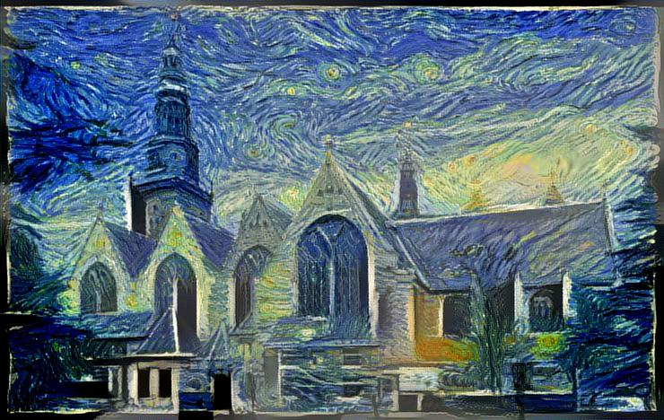
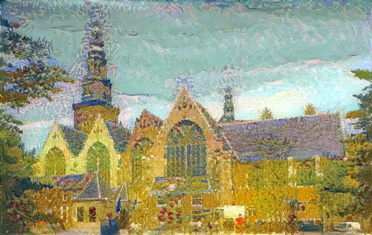

```python
from tensorflow.keras.preprocessing.image import load_img, img_to_array
from tensorflow.keras.applications import vgg16, vgg19
from tensorflow.keras import backend as K
import numpy as np
import time
import glob

import imageio
from scipy.optimize import fmin_l_bfgs_b
from itertools import combinations

from scipy.misc import imread, imresize, imsave, fromimage, toimage

try:
    from io import BytesIO
except ImportError:
    from StringIO import StringIO as BytesIO
import PIL
from IPython.display import clear_output, Image, display, HTML
```


```python
base_image_path = 'style_transfer/Okerk2.jpg'
style1_image_path = 'style_transfer/water-lilies-1919-2.jpg'
style2_image_path = 'style_transfer/VanGogh-starry_night_ballance1.jpg'

```


```python
def showarray(a, fmt='jpeg'):
    f = BytesIO()
    PIL.Image.fromarray(a).save(f, fmt)
    display(Image(data=f.getvalue()))

def preprocess_image(image_path, target_size=None):
    img = load_img(image_path, target_size=target_size)
    img = img_to_array(img)
    img = np.expand_dims(img, axis=0)
    img = vgg16.preprocess_input(img)
    return img

def deprocess_image(x, w, h):
    if K.image_data_format() == 'channels_first':
        x = x.reshape((3, w, h))
        x = x.transpose((1, 2, 0))
    else:
        x = x.reshape((w, h, 3))
    # Remove zero-center by mean pixel
    x[:, :, 0] += 103.939
    x[:, :, 1] += 116.779
    x[:, :, 2] += 123.68
    # 'BGR'->'RGB'
    x = x[:, :, ::-1]
    x = np.clip(x, 0, 255).astype('uint8')
    return x
```


```python
w, h = 740, 468
style_image = K.variable(preprocess_image(style1_image_path, target_size=(h, w)))
result_image = K.placeholder(style_image.shape)
input_tensor = K.concatenate([style_image,
                              result_image], axis=0)
input_tensor.shape
```


    TensorShape([Dimension(2), Dimension(468), Dimension(740), Dimension(3)])


```python
model = vgg16.VGG16(input_tensor=input_tensor,
#                    weights='imagenet', include_top=False)
                    weights='style_transfer/vgg16_weights_tf_dim_ordering_tf_kernels_notop.h5', include_top=False)


print('Model loaded.')
```

    WARNING:tensorflow:From /root/miniconda3/lib/python3.7/site-packages/tensorflow/python/ops/init_ops.py:1251: calling VarianceScaling.__init__ (from tensorflow.python.ops.init_ops) with dtype is deprecated and will be removed in a future version.
    Instructions for updating:
    Call initializer instance with the dtype argument instead of passing it to the constructor
    Model loaded.


```python
class Evaluator(object):
    def __init__(self, loss_total, result_image, **other):
        grads = K.gradients(loss_total, result_image)
        outputs = [loss_total] + list(other.values()) + grads
        self.iterate = K.function([result_image], outputs)
        self.other = list(other.keys())
        self.other_values = {}
        self.shape = result_image.shape

        self.loss_value = None
        self.grads_values = None

    def loss(self, x):
        outs = self.iterate([x.reshape(self.shape)])
        self.loss_value = outs[0]
        self.grad_values = outs[-1].flatten().astype('float64')
        self.other_values = dict(zip(self.other, outs[1:-1]))
        return self.loss_value

    def grads(self, x):
        return np.copy(self.grad_values)
```


```python
def gram_matrix(x):
    if K.image_data_format() != 'channels_first':
        x = K.permute_dimensions(x, (2, 0, 1))
    features = K.batch_flatten(x)
    return K.dot(features - 1, K.transpose(features - 1)) - 1

def style_loss(layer_1, layer_2):
    gr1 = gram_matrix(layer_1)
    gr2 = gram_matrix(layer_2)
    return K.sum(K.square(gr1 - gr2)) / (int(np.prod(layer_2.shape)) ** 2)
```


```python
feature_outputs = [layer.output for layer in model.layers if '_conv' in layer.name]

loss_style = K.variable(0.)
for idx, layer_features in enumerate(feature_outputs):
    loss_style = loss_style + style_loss(layer_features[0, :, :, :], layer_features[1, :, :, :])

style_evaluator = Evaluator(loss_style, result_image)
```


```python
def run(evaluator, image, num_iter=25):
    for i in range(num_iter):
        start_time = time.time()

        image, min_val, info = fmin_l_bfgs_b(evaluator.loss, image.flatten(), fprime=evaluator.grads, maxfun=20)

        end_time = time.time()
        clear_output()
        showarray(deprocess_image(image.copy(), h, w))

        print("Iteration %d completed in %ds" % (i + 1, end_time - start_time))
        print("Current loss value:", min_val)
        print(' '.join(k + ':' + str(evaluator.other_values[k]) for k in evaluator.other))
    return image
```


```python
x = np.random.uniform(0, 255, result_image.shape) - 128.
res = run(style_evaluator, x, num_iter=50)
```


    

    


    Iteration 50 completed in 5s
    Current loss value: 7717535.5
    


```python
def total_variation_loss(x, exp=1.25):
    _, d1, d2, d3 = x.shape
    if K.image_data_format() == 'channels_first':
        a = K.square(x[:, :, :d2 - 1, :d3 - 1] - x[:, :, 1:, :d3 - 1])
        b = K.square(x[:, :, :d2 - 1, :d3 - 1] - x[:, :, :d2 - 1, 1:])
    else:
        a = K.square(x[:, :d1 - 1, :d2 - 1, :] - x[:, 1:, :d2 - 1, :])
        b = K.square(x[:, :d1 - 1, :d2 - 1, :] - x[:, :d1 - 1, 1:, :])
    return K.sum(K.pow(a + b, exp))
```


```python
loss_variation = total_variation_loss(result_image) / 5000

loss_with_variation = loss_variation + loss_style

evaluator_with_variation = Evaluator(loss_with_variation, result_image)
```

    WARNING:tensorflow:From /root/miniconda3/lib/python3.7/site-packages/tensorflow/python/ops/math_grad.py:1205: add_dispatch_support.<locals>.wrapper (from tensorflow.python.ops.array_ops) is deprecated and will be removed in a future version.
    Instructions for updating:
    Use tf.where in 2.0, which has the same broadcast rule as np.where


```python
x = np.random.uniform(0, 255, result_image.shape) - 128.
res = run(evaluator_with_variation, x, num_iter=100)
```


    

    


    Iteration 100 completed in 5s
    Current loss value: 7588291.0
    


```python
def content_loss(base, combination):
    return K.sum(K.square(combination - base))
```


```python
w, h = load_img(base_image_path).size
base_image = K.variable(preprocess_image(base_image_path))
style_image = K.variable(preprocess_image(style2_image_path, target_size=(h, w)))
combination_image = K.placeholder(style_image.shape)
input_tensor = K.concatenate([base_image,
                              style_image,
                              combination_image], axis=0)
```


```python
model = vgg16.VGG16(input_tensor=input_tensor,
                    weights='imagenet', include_top=False)
print('Model loaded.')
```

    Downloading data from https://github.com/fchollet/deep-learning-models/releases/download/v0.1/vgg16_weights_tf_dim_ordering_tf_kernels_notop.h5
    58892288/58889256 [==============================] - 32s 1us/step
    Model loaded.


```python
feature_outputs = [layer.output for layer in model.layers if '_conv' in layer.name]

loss_content = content_loss(feature_outputs[-1][0, :, :, :],
                            feature_outputs[-1][2, :, :, :])
loss_variation = total_variation_loss(combination_image)
loss_style = K.variable(0.)
for idx, layer_features in enumerate(feature_outputs):
    loss_style = loss_style + style_loss(layer_features[1, :, :, :], layer_features[2, :, :, :]) * (0.5 ** idx)

loss_content /= 40
loss_variation /= 10000

loss_total = loss_content + loss_variation + loss_style
```


```python
combined_evaluator = Evaluator(loss_total, combination_image, loss_content=loss_content, 
                               loss_variation=loss_variation, loss_style=loss_style)
run(combined_evaluator, preprocess_image(base_image_path), num_iter=100)
```


    

    


    Iteration 100 completed in 5s
    Current loss value: 1233926.8
    loss_content:132816.56 loss_variation:837245.75 loss_style:263864.5


    array([ -89.34402093, -105.89122353, -122.82165534, ...,  -78.17994675,
           -118.5438742 , -131.84572998])


```python
w, h = load_img(base_image_path).size
base_image = K.variable(preprocess_image(base_image_path))
winter_style_image = K.variable(preprocess_image('style_transfer/road-to-versailles-at-louveciennes.jpg',
                                                 target_size=(h, w)))
summer_style_image = K.variable(preprocess_image('style_transfer/VanGogh_Farmhouse.jpeg', target_size=(h, w)))
combination_image = K.placeholder(summer_style_image.shape)
input_tensor = K.concatenate([base_image,
                              summer_style_image,
                              winter_style_image,
                              combination_image], axis=0)
```


```python
model = vgg16.VGG16(input_tensor=input_tensor,
                    weights='imagenet', include_top=False)
print('Model loaded.')
```

    Model loaded.


```python
feature_outputs = [layer.output for layer in model.layers if '_conv' in layer.name]

loss_content = content_loss(feature_outputs[-1][0, :, :, :],
                            feature_outputs[-1][2, :, :, :])
loss_variation = total_variation_loss(combination_image)

loss_style_summer = K.variable(0.)
loss_style_winter = K.variable(0.)
for idx, layer_features in enumerate(feature_outputs):
    loss_style_summer = loss_style_summer + style_loss(layer_features[1, :, :, :], layer_features[-1, :, :, :]) * (0.5 ** idx)
    loss_style_winter = loss_style_winter + style_loss(layer_features[2, :, :, :], layer_features[-1, :, :, :]) * (0.5 ** idx)

loss_content /= 40
loss_variation /= 10000

summerness = K.placeholder()
loss_total = (loss_content + loss_variation + 
              loss_style_summer * summerness + 
              loss_style_winter * (1 - summerness))
```


```python
combined_evaluator = Evaluator(loss_total, combination_image, loss_content=loss_content, 
                               loss_variation=loss_variation, loss_style_summer=loss_style_summer,
                               loss_style_winter=loss_style_winter)
iterate = K.function([combination_image, summerness], 
                     combined_evaluator.iterate.outputs)

combined_evaluator.iterate = lambda inputs: iterate(inputs + [1.0])
res = run(combined_evaluator, preprocess_image(base_image_path), num_iter=50)
```


    

    


    Iteration 50 completed in 7s
    Current loss value: 1542387.4
    loss_content:977338.8 loss_variation:484707.7 loss_style_summer:80340.84 loss_style_winter:699645800.0


```python
path = 'style_transfer/summer_winter_%d.jpg'
def save(res, step):
    img = deprocess_image(res.copy(), h, w)
    imsave(path % step, img)

for step in range(1, 21):
    combined_evaluator = Evaluator(loss_total, combination_image, loss_content=loss_content, 
                                   loss_variation=loss_variation, loss_style_summer=loss_style_summer,
                                   loss_style_winter=loss_style_winter)
    iterate = K.function([combination_image, summerness], 
                         combined_evaluator.iterate.outputs)

    combined_evaluator.iterate = lambda inputs: iterate(inputs + [1.0 - step / 20.])
    res = run(combined_evaluator, preprocess_image(base_image_path), num_iter=50)
    save(res, step)
```


    

    


    Iteration 50 completed in 7s
    Current loss value: 1391370.9
    loss_content:977338.8 loss_variation:365301.8 loss_style_summer:699556740.0 loss_style_winter:48730.203


    /root/miniconda3/lib/python3.7/site-packages/ipykernel_launcher.py:4: DeprecationWarning: `imsave` is deprecated!
    `imsave` is deprecated in SciPy 1.0.0, and will be removed in 1.2.0.
    Use ``imageio.imwrite`` instead.
      after removing the cwd from sys.path.


```python
frames = glob.glob('style_transfer/summer_winter_*.jpg')
frames = sorted(frames, key=lambda f:int(f.split('.', 1)[0].rsplit('_', 1)[-1]))
cycled = frames + list(reversed(frames[1:-1]))
# Save them as frames into a gif 
kargs = { 'duration': 0.1 }
imageio.mimsave('style_transfer/animated.gif', [imageio.imread(x) for x in cycled], 'GIF', **kargs)

HTML('')
```


```python

```
